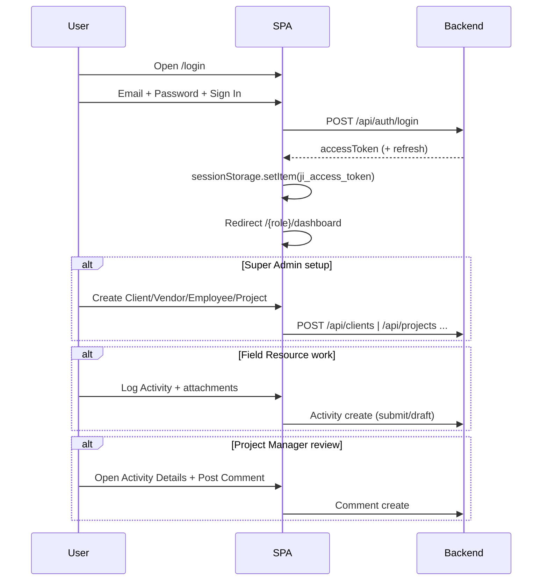

# PROJECT ANALYSIS — JIT Project Activity Reporting System

> **Source of truth:** Staging SPA (`https://staging.d1u0ld8155t0io.amplifyapp.com`), role Excel packs (`JIT Super Admin.xlsx`, `JIT Project Manager.xlsx`, `JIT Field Resource.xlsx`), and the Playwright automation repository.  
> **Important:** This repository is a **test automation suite**, not the application source. Application behaviour below is inferred from UI routes, page objects, API contracts observed in tests, and manual test-case packs.

---

## 1. Purpose

**JIT (Project Activity Reporting System)** is an enterprise SaaS platform for construction / field-operations teams to:

- Manage **clients**, **vendors**, and **employees** (masters)
- Create and publish **projects** with role assignments
- Allow **Field Resources** (and Project Managers) to **log daily work activities** with attachments
- Allow **Project Managers** to **review activities**, mark context, and **post comments**
- Give **Super Admin** system-wide visibility via dashboard, masters, and all activity logs
- Enforce **role-based access** across `/super-admin/*`, `/project-manager/*`, and `/field-resource/*`

Product tagline / login heading: **Project Activity Reporting System**.

---

## 2. Architecture

```
┌─────────────────┐     HTTPS      ┌──────────────────────────────┐
│  Browser (SPA)  │ ◄────────────► │ Amplify-hosted Frontend      │
│  sessionStorage │                │ staging.d1u0ld8155t0io...    │
│  JWT tokens     │                └──────────────┬───────────────┘
└─────────────────┘                               │
                                                  │ REST /api/*
                                                  ▼
                                   ┌──────────────────────────────┐
                                   │ Backend API                  │
                                   │ (observed: ji-tech.duckdns.org│
                                   │  and Amplify-relative /api)  │
                                   │ Auth · Dashboard · Masters · │
                                   │ Projects · Activities · Notif│
                                   └──────────────────────────────┘
```

### Auth model

| Concern | Observed behaviour |
|--------|---------------------|
| Login API | `POST /api/auth/login` |
| Success contract | HTTP 200, `{ success: true, data.accessToken, ... }` |
| Token storage | `sessionStorage.ji_access_token`, `sessionStorage.ji_refresh_token` |
| Cookie auth | **Not used** for SPA session (JWT in sessionStorage) |
| Logout | UI profile menu + clear `sessionStorage` / `localStorage` |
| Protected routes | Role-prefixed paths; unauthenticated access redirects to `/login` |

### Frontend routing (role portals)

| Portal | Base path | Home |
|--------|-----------|------|
| Super Admin | `/super-admin/*` | `/super-admin/dashboard` |
| Project Manager | `/project-manager/*` | `/project-manager/dashboard` |
| Field Resource | `/field-resource/*` | `/field-resource/dashboard` |
| Shared | `/login` | Sign In |

### Observed APIs

| Method | Endpoint | Purpose |
|--------|----------|---------|
| POST | `/api/auth/login` | Authenticate |
| GET | `/api/dashboard` | SA dashboard aggregates |
| GET | `/api/notifications` | Notification feed |
| GET | `/api/clients?page&search&status` | Client list (paginated) |
| POST | `/api/clients` | Create client |
| DELETE | `/api/clients/:id` | Delete client |
| POST | `/api/projects` | Create/publish project |

List responses commonly include `success`, `data`, and `pagination.{page,limit,total,totalPages}`.

---

## 3. Modules

| Module | Roles | Description |
|--------|-------|-------------|
| Authentication | All | Login, logout, remember me, forgot password |
| Dashboard | SA / PM / FR | Role-specific KPIs, quick links, recent activity |
| Notifications | All (UI present) | Unread / Read tabs |
| Activity Logs | SA / PM / FR | Search, filters, date range, details dialog, pagination |
| Log Activity | PM / FR | Submit / draft activity with rich text, category, uploads, critical flag |
| Projects | SA / PM / FR | List, search, filters, details (Overview / Users / Documents / Activity Logs) |
| Create Project | SA only | Masters + assignments + draft/publish |
| Clients | SA only | Master CRUD + Users tab |
| Vendors | SA only | Master create / search / filter |
| Employees / Users | SA only | Create users with role Super Administrator / Project Manager / Field Resource |
| My Team | PM only | Team members, activities, member details |
| Comments | PM (write); FR (read restricted on staging) | Activity detail comments |
| Uploads | FR / PM | Photos (PNG/JPG), Documents (PDF) |
| Reports / Charts | SA / PM | Projects by status; clients/vendors/employees; logs submitted |

---

## 4. Business Flow (happy path)

```
Super Admin
  ├─ Create Client + Vendor
  ├─ Create Project Manager + Field Resource employees
  ├─ Create Project → assign Client, Vendor, PM(s), FR(s) → Publish
  └─ Monitor Dashboard / Activity Logs / Masters

Project Manager
  ├─ Sees only assigned projects
  ├─ (Optional) Log own activity
  ├─ Reviews team Activity Logs
  ├─ Posts comments / attachments on activities
  └─ Manages My Team visibility

Field Resource
  ├─ Sees only assigned projects (My Projects)
  ├─ Logs activity (submit or draft) with photos/docs
  ├─ Can mark activity Critical
  ├─ Views own Activity Logs / drafts
  └─ Cannot comment (permission message)
```

Cross-role chain validated by E2E_001 → E2E_010:

1. SA publishes project with PM + FR  
2. PM verifies assignment  
3. FR submits activity (+ attachments)  
4. PM comments  
5. FR attempts to see comment (staging may hide)  
6. Draft → submit lifecycle  
7. Critical flag visible to PM  
8. SA project note update syncs to PM/FR  
9. RBAC redirects for forbidden URLs  
10. Full loop + post-logout protection

---

## 5. Folder Structure (this automation repo)

```
JIT/
├── fixtures/           # Playwright fixtures (auth)
├── pages/              # Page Object Model by role
│   ├── LoginPage.js
│   ├── superAdmin/
│   ├── projectManager/
│   └── fieldResource/
├── tests/
│   ├── login.spec.js
│   ├── superAdmin/     # Module specs
│   └── e2e/            # Cross-role workflows E2E_001–010
├── test-data/          # Users, masters seeds, e2e fixtures
├── utils/              # Network, unique data, e2e state/workflow
├── docs/               # QA analysis (this folder)
├── playwright.config.js
├── package.json
├── .env.example
└── JIT *.xlsx          # Manual TC packs per role
```

---

## 6. User Journey

### Super Admin

1. Login → SA Dashboard  
2. Quick-nav to Clients / Vendors / Employees / Projects / Activity Logs  
3. Create masters → Create & publish project with assignments  
4. Monitor KPIs, notifications, recent critical activities  

### Project Manager

1. Login → PM Dashboard (assigned KPIs)  
2. Projects → only assigned; open Overview / Users / Documents / Activity Logs  
3. Activity Logs → open details → Post Comment  
4. My Team → member details → activities  

### Field Resource

1. Login → FR Dashboard  
2. My Projects → read-only details  
3. Log Activity → fill form → Save Draft or Submit  
4. Activity Logs → view submitted/drafts; no comment write  

---

## 7. Application Flow (sequence)



---

## 8. Reusable Components (UI patterns)

Inferred shared UI building blocks (not separate app source in this repo):

| Pattern | Where used |
|---------|------------|
| Left sidebar navigation | All roles |
| Summary / KPI cards | Dashboards, Activity Logs, My Team |
| Search textbox | Projects, Clients, Vendors, Employees, Logs |
| Status / Role combobox filters | Masters, Projects, Logs |
| Date From / To pickers | Activity Logs |
| Data tables + pagination + “Showing X–Y” | Masters, Projects, Logs |
| Detail dialog / side panel | Activity details, Client details, Team member details |
| Notifications dialog (Unread / Read) | Header |
| Profile menu (email + logout) | Header / complementary region |
| Rich text / contenteditable Work Performed | Log Activity |
| File upload (Photos / Documents tabs) | Log Activity |
| Toast / `role="alert"` | Login + form feedback |
| Empty states | “No … found” |
| Critical badge / status badges | Activity lists & details |

---

## 9. Potential Risks

| Risk | Impact | Notes |
|------|--------|-------|
| JWT only in sessionStorage | Session lost on tab close; XSS can steal tokens | Verify refresh-token rotation & XSS hardening |
| Client-side RBAC redirects only | API may still allow unauthorized calls | Need API-level authz tests |
| Staging comment visibility for FR | Product inconsistency | E2E_005 documents FR may see `Comments (0)` |
| Duplicate client names allowed (201) | Data quality | Observed in SA client tests |
| Alphabetic phone accepted on clients | Validation gap | Observed defect pattern |
| Pagination UI vs API mismatch | Trust in paging | Page 2 API may fire while UI stays on page 1 |
| No sort (`aria-sort`) on clients | A11y / UX gap | Documented in automation comments |
| Hardcoded dashboard API host in tests | Flaky vs BASE_URL | Framework risk |
| E2E shared JSON state + parallel runs | Race / overwrite | `fullyParallel` vs ordered E2E |
| No test-data cleanup | Staging pollution | Permanent E2E users/projects |
| Project Edit may be missing | E2E_008 skip | Incomplete update sync coverage |
| Role naming inconsistency | Confusion | UI: “Super Administrator” vs env “Super Admin” |
| Employee empty state “No users found” | Copy inconsistency | Masters naming |
| Missing Manager / Employee / Admin as separate portals | Only 3 portals found | Excel mentions Manager elsewhere — **not present as distinct app role in staging automation** |

### Roles confirmed in product

1. **Super Admin / Super Administrator**  
2. **Project Manager**  
3. **Field Resource**  

Assignable on employee create: Super Administrator, Project Manager, Field Resource.  
**No separate “Manager”, “Employee”, or “Admin” portal** was verified beyond env key aliases (`ADMIN_*` = Project Manager, `EMPLOYEE_*` = Field Resource).

---

## 10. Environments

| Env | How |
|-----|-----|
| Staging (default) | `playwright.config.js` `baseURL` |
| Local | `BASE_URL=http://localhost:3000` |
| Credentials | `.env` from `.env.example` |

---

*Document owner: QA Architecture — Phase 1*  
*Last updated: 2026-07-28*
